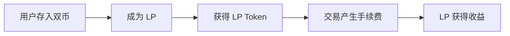

## 什么是 AMM

自动做市商（Automated Market Maker）是去中心化交易所（DEX）的核心机制，用数学公式代替传统订单簿来实现资产交易。

## 核心公式：恒定乘积

```
x * y = k
```

- **x** = Token A 的数量
- **y** = Token B 的数量
- **k** = 常数（流动性总量保持不变）

### 公式含义

无论交易如何进行，池中两种 token 的乘积始终保持不变。这导致：
- 买入 Token A → A 减少，B 增加 → A 价格上涨
- 卖出 Token A → A 增加，B 减少 → A 价格下跌

## AMM 工作流程



1. **提供流动性**：用户存入等值的双币（如 1 ETH + 1800 USDC）
2. **获得凭证**：收到 LP Token，代表池子份额
3. **交易发生**：其他用户 swap，支付手续费（通常 0.3%）
4. **收益分配**：手续费累积到池中，LP 按比例分享

## 关键概念

| 术语 | 说明 | 重要性 |
|------|------|--------|
| 流动性池 | 存放交易对的智能合约 | ⭐⭐⭐⭐⭐ |
| LP Token | 流动性凭证，可随时赎回 | ⭐⭐⭐⭐⭐ |
| 滑点 | 大额交易导致的价格偏移 | ⭐⭐⭐⭐ |
| 无常损失 | 币价波动导致的相对损失 | ⭐⭐⭐⭐⭐ |

## 实战要点

### 小额交易（<1000 USD）
- 滑点可忽略不计
- 直接用 Uniswap/Sushiswap

### 大额交易（>10000 USD）
- 分多笔执行
- 使用聚合器（1inch、Matcha）
- 考虑使用 Flashbots 避免 MEV

### 选择池子
- **看深度** > 看 APY
- 深度不足时，高 APY 可能是陷阱
- 检查历史 TVL 稳定性

## 无常损失详解

无常损失（Impermanent Loss）是 LP 最常见的风险：

**场景**：ETH 从 1800 涨到 3600（翻倍）

| 策略 | 最终价值 | 对比持有 |
|------|----------|----------|
| 持有 1 ETH + 1800 USDC | 5400 USDC | 基准 |
| 提供流动性 | 4242 USDC | -21.5% |

**结论**：币价波动越大，无常损失越严重。

## 总结

AMM 是 DEX 的基石，理解其原理是成为合格 LP 的第一步。记住：

1. 公式简单但影响深远
2. 无常损失是真实风险
3. 长期持有 + 低波动 = 最佳 LP 场景

---

**下一步阅读**：[流动性管理策略](/dex-bok/posts/02-liquidity-strategies/)
