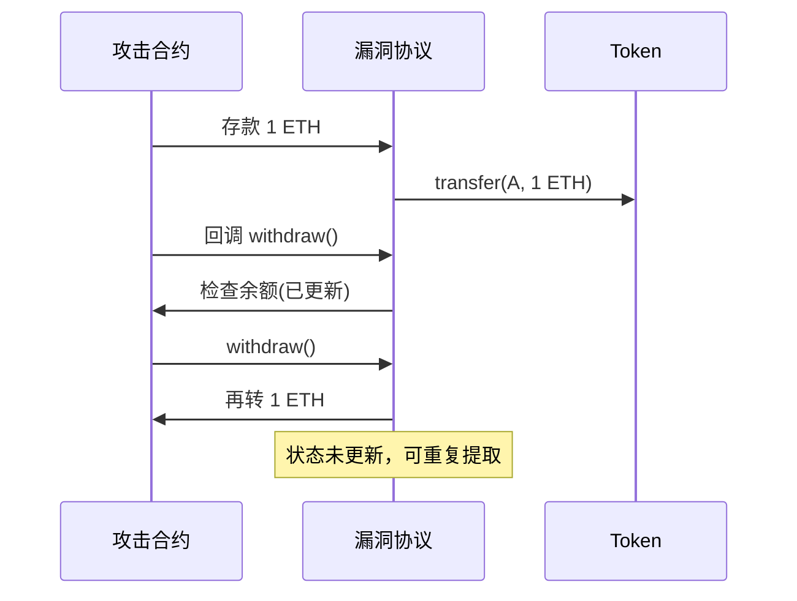

## 前言

DeFi 协议累计遭受攻击损失已超过 **60 亿美元**。本文将从实战角度分析常见攻击手段，并提供可落地的防护方案。

## 一、2024-2025 年重大攻击事件

| 协议 | 损失金额 | 攻击类型 | 时间 |
|------|----------|----------|------|
| Euler Finance | $197M | 闪电贷 + 薄授权 | 2023.03 |
| Curve Finance | $73M | 重入攻击 | 2023.07 |
| Mixin Network | $200M | 预言机攻击 | 2023.09 |
| BonqDAO | $89M | 预言机操纵 | 2023.02 |

## 二、Flash Loan 闪电贷攻击

### 2.1 攻击原理

闪电贷允许在单笔交易内借出并归还任意数量的资产，无需抵押。攻击者利用这一特性：

1. 借款 → 操纵价格/触发漏洞 → 归还 → 获利

```solidity
// 典型 Flash Loan 攻击流程
interface IFlashLoanReceiver {
    function executeOperation(
        address[] calldata tokens,
        uint256[] calldata amounts,
        uint256[] calldata premiums,
        address initiator,
        bytes calldata params
    ) external;
}

contract Attacker {
    function attack(address pool, address target) external {
        // 1. 从闪电贷池借款
        IERC20(usdt).flashLoan(
            1000000 * 1e6,  // 借 100万 USDT
            address(this),
            "",
            ""
        );
    }
    
    function executeOperation(
        address[] calldata tokens,
        uint256[] calldata amounts,
        uint256[] calldata premiums,
        address initiator,
        bytes calldata params
    ) external override {
        // 2. 在目标协议执行攻击操作
        // - 操纵预言机价格
        // - 触发漏洞合约逻辑
        // - 清算抵押不足头寸
        
        // 3. 归还借款 + 手续费
        uint256 amount = amounts[0];
        uint256 premium = premiums[0];
        IERC20(tokens[0]).approve(msg.sender, amount + premium);
        
        // 4. 获利转出
        // profit = attack_revenue - (amount + premium)
    }
}
```

### 2.2 Euler Finance 攻击详解（2023）

**漏洞原理**：薄授权（Bent Authorization）允许存款人直接提取协议外的资产：

```solidity
// 有漏洞的代码
function donateToReserves(uint256 amount) external {
    require(userMarkets[msg.sender].collateralFactor > 0, "Not enabled");
    // ❌ 缺少身份验证：任何人都可以为他人捐赠
    _burn(msg.sender, amount);
    totalReserves += amount;
}

function withdraw(uint256 amount) external {
    // ✅ 正常提取逻辑有检查
    require(balanceOf[msg.sender] >= amount, "Insufficient balance");
    // ...
}
```

**攻击步骤**：

```
1. Flash Loan 借出 30M DAI
2. 存入 Euler → 得到 eDAI
3. 调用 donateToReserves() 将资产"捐赠"给自己
4. 提取超过实际存款的金额
5. 归还 Flash Loan → 获利 197M
```

### 2.3 防护方案

```solidity
// 正确实现：限制捐赠权限
contract EulerV2 {
    mapping(address => bool) public authorizedDonators;
    
    function donateToReserves(uint256 amount) external {
        require(
            authorizedDonators[msg.sender] || msg.sender == liquidityMining,
            "Not authorized"  // ✅ 添加权限检查
        );
        _burn(msg.sender, amount);
        totalReserves += amount;
    }
    
    // 或者：使用事件驱动而非即时更新
    struct DonationRequest {
        address user;
        uint256 amount;
        uint256 unlockTime;
    }
}
```

## 三、重入攻击

### 3.1 攻击原理

合约在状态更新前调用外部合约，攻击者利用回调函数再次进入原合约：



### 3.2 The DAO 事件（经典案例）

```solidity
// 有漏洞的代码
function withdraw() external {
    uint256 balance = balances[msg.sender];
    require(balance > 0, "No balance");
    
    // ❌ 先转账，后更新状态
    (bool success, ) = msg.sender.call{value: balance}("");
    require(success, "Transfer failed");
    
    // 状态更新在转账之后
    balances[msg.sender] = 0;  // 可被重入跳过
}
```

### 3.3 防护方案

**方案一：Checks-Effects-Interactions 模式**

```solidity
function withdraw() external {
    uint256 balance = balances[msg.sender];
    require(balance > 0, "No balance");
    
    // ✅ 1. 先检查
    // ✅ 2. 再更新状态
    balances[msg.sender] = 0;
    
    // ✅ 3. 最后转账
    (bool success, ) = msg.sender.call{value: balance}("");
    require(success, "Transfer failed");
}
```

**方案二：ReentrancyGuard**

```solidity
import "@openzeppelin/contracts/security/ReentrancyGuard.sol";

contract SafeVault is ReentrancyGuard {
    mapping(address => uint256) public balances;
    
    function withdraw() external nonReentrant {
        uint256 balance = balances[msg.sender];
        require(balance > 0, "No balance");
        
        balances[msg.sender] = 0;
        
        (bool success, ) = msg.sender.call{value: balance}("");
        require(success, "Transfer failed");
    }
}
```

**方案三：Pull Payment 模式**

```solidity
// 避免在函数内直接转账
mapping(address => uint256) public pendingWithdrawals;

function withdraw() external {
    uint256 amount = pendingWithdrawals[msg.sender];
    require(amount > 0, "No pending withdrawal");
    
    pendingWithdrawals[msg.sender] = 0;  // 先更新状态
    
    // 使用独立函数提款，而非直接转账
    (bool success, ) = msg.sender.call{value: amount}("");
    require(success, "Transfer failed");
}
```

## 四、预言机操纵攻击

### 4.1 攻击原理

使用少量资金操纵 DEX 池价格，导致预言机返回错误价格：

```solidity
// 攻击演示
contract OracleManipulator {
    IUniswapV2Pair public pair;
    IPriceOracle public oracle;
    
    function attack(uint256 amount) external {
        // 1. 闪电贷获取资金
        // 2. 大额 Swap 操纵价格
        (uint112 reserve0, uint112 reserve1, ) = pair.getReserves();
        
        // 假设 USDC/ETH 池
        // 买入大量 ETH → ETH 价格暴涨
        pair.swap(amount, 0, address(this), "");
        
        // 3. 预言机读取被操纵的价格
        uint256 price = oracle.getPrice();  // 返回错误价格
        
        // 4. 在其他协议利用错误价格套利
        // 5. 反向 Swap 恢复价格，归还闪电贷
    }
}
```

### 4.2 防护方案

**方案一：TWAP 预言机**

```solidity
// Uniswap V3 TWAP - 使用时间加权平均价格
contract TWAPOracle {
    using FixedPoint for *;
    
    struct Observation {
        uint32 timestamp;
        uint256 cumulativePrice;
    }
    
    mapping(uint256 => Observation[]) public observations;
    
    function consult(address token, uint256 secondsAgo) 
        public view returns (uint256 amountOut) 
    {
        require(secondsAgo != 0, "Cannot use current tick");
        
        uint256[] memory observations = new uint256[](2);
        // 获取历史两个观测点
        observations[0] = _getObservation(tick, secondsAgo);
        observations[1] = _getObservation(tick, 0);
        
        // 计算时间加权平均
        // 即使攻击者短暂操纵价格，也无法影响长期均价
        return _computeAmountOut(observations);
    }
}
```

**方案二：多预言机组合**

```solidity
// 聚合多个价格源
contract ChainlinkOracle {
    using SafeChainlink for *;
    
    AggregatorV3Interface public primaryOracle;
    AggregatorV3Interface public secondaryOracle;
    
    uint256 public constant DEVIATION_THRESHOLD = 5 * 1e16;  // 5%
    
    function getLatestPrice() external view returns (uint256) {
        (, int256 primaryPrice, , , ) = primaryOracle.latestRoundData();
        (, int256 secondaryPrice, , , ) = secondaryOracle.latestRoundData();
        
        // 检查两个价格偏差
        uint256 diff = primaryPrice > secondaryPrice 
            ? primaryPrice - secondaryPrice 
            : secondaryPrice - primaryPrice;
            
        require(
            diff <= uint256(primaryPrice) * DEVIATION_THRESHOLD,
            "Price deviation too high"
        );
        
        // 返回中位数
        return uint256(primaryPrice) >= uint256(secondaryPrice) 
            ? uint256(secondaryPrice) 
            : uint256(primaryPrice);
    }
}
```

## 五、智能合约审计清单

### 5.1 核心检查项

| 类别 | 检查项 | 严重程度 |
|------|--------|----------|
| 访问控制 | 关键函数是否仅有授权地址可调用 | 🔴 严重 |
| 整数溢出 | 是否有 SafeMath 或 Solidity 0.8+ | 🔴 严重 |
| 重入 | 是否使用 Checks-Effects-Interactions | 🔴 严重 |
| 权限控制 | 是否有 pausable 机制 | 🟠 高 |
| 预言机 | 价格来源是否可靠 | 🟠 高 |
| 闪电贷 | 是否考虑闪电贷攻击场景 | 🟠 高 |

### 5.2 常见漏洞模式

```solidity
// ❌ 漏洞模式 1: 整数溢出
function unsafeAdd(uint256 a, uint256 b) pure returns (uint256) {
    return a + b;  // Solidity < 0.8 会溢出
}

// ✅ 修复
function safeAdd(uint256 a, uint256 b) pure returns (uint256) {
    return a + b;  // Solidity 0.8+ 自动检查
    // 或使用 SafeMath
}

// ❌ 漏洞模式 2: 未检查返回值
function transferToUser(address to, uint256 amount) external {
    IERC20(token).transfer(to, amount);  // 未检查返回值
}

// ✅ 修复
function transferToUser(address to, uint256 amount) external {
    require(
        IERC20(token).transfer(to, amount),
        "Transfer failed"
    );
}

// ❌ 漏洞模式 3: 错误的权限检查
function setOwner(address newOwner) external {
    require(msg.sender == owner);  // ✅ 检查正确
    owner = newOwner;
}

// ❌ 漏洞模式 4: 错误的比较
function test() external {
    require(msg.sender != address(0));  // 缺少返回
    // 后续代码可能仍在 owner = address(0) 时执行
}
```

### 5.3 审计工具推荐

| 工具 | 类型 | 用途 |
|------|------|------|
| Slither | 静态分析 | 自动检测常见漏洞 |
| Mythril | 符号执行 | 深度漏洞分析 |
| Hardhat | 测试框架 | 模糊测试 |
| OpenZeppelin Contracts | 库 | 安全标准实现 |

```bash
# Slither 使用示例
slither . --exclude-dependencies --json report.json
```

## 六、实战：完整防护合约示例

```solidity
// SPDX-License-Identifier: MIT
pragma solidity ^0.8.19;

import "@openzeppelin/contracts/security/ReentrancyGuard.sol";
import "@openzeppelin/contracts/security/Pausable.sol";
import "@openzeppelin/contracts/access/AccessControl.sol";

/**
 * @title SecureVault
 * @dev 带完整安全防护的 Vault 实现
 */
contract SecureVault is ReentrancyGuard, Pausable, AccessControl {
    bytes32 public constant PAUSER_ROLE = keccak256("PAUSER_ROLE");
    bytes32 public constant KEEPER_ROLE = keccak256("KEEPER_ROLE");
    
    mapping(address => uint256) public balances;
    uint256 public totalDeposits;
    
    // 闪电贷防护：记录单笔交易内的转出总额
    mapping(address => uint256) public withdrawalLimit;
    uint256 public globalWithdrawalLimit = 1e9 ether;
    
    // 事件追踪
    event Deposit(address indexed user, uint256 amount);
    event Withdrawal(address indexed user, uint256 amount);
    event EmergencyWithdraw(address indexed user, uint256 amount, string reason);
    
    constructor() {
        _grantRole(DEFAULT_ADMIN_ROLE, msg.sender);
        _grantRole(PAUSER_ROLE, msg.sender);
    }
    
    /**
     * @dev 安全的存款函数
     */
    function deposit(uint256 amount) external nonReentrant whenNotPaused {
        require(amount > 0, "Cannot deposit 0");
        require(
            IERC20(address(0)).transferFrom(msg.sender, address(this), amount),
            "Transfer failed"
        );
        
        // ✅ Checks-Effects-Interactions
        balances[msg.sender] += amount;
        totalDeposits += amount;
        
        emit Deposit(msg.sender, amount);
    }
    
    /**
     * @dev 安全的提款函数
     */
    function withdraw(uint256 amount) external nonReentrant {
        require(amount > 0, "Cannot withdraw 0");
        require(balances[msg.sender] >= amount, "Insufficient balance");
        
        // ✅ 更新状态
        balances[msg.sender] -= amount;
        totalDeposits -= amount;
        
        // ✅ 闪电贷防护：检查单笔限额
        require(
            amount <= withdrawalLimit[msg.sender] || 
            msg.sender == tx.origin,
            "Withdrawal limit exceeded"
        );
        
        // ✅ 转账
        require(
            IERC20(address(0)).transfer(msg.sender, amount),
            "Transfer failed"
        );
        
        emit Withdrawal(msg.sender, amount);
    }
    
    /**
     * @dev 紧急暂停（仅管理员）
     */
    function pause() external onlyRole(PAUSER_ROLE) {
        _pause();
    }
    
    function unpause() external onlyRole(PAUSER_ROLE) {
        _unpause();
    }
    
    /**
     * @dev 设置用户提款限额（仅管理员）
     */
    function setWithdrawalLimit(
        address user, 
        uint256 limit
    ) external onlyRole(DEFAULT_ADMIN_ROLE) {
        withdrawalLimit[user] = limit;
    }
}
```

## 总结

DeFi 安全是一场持续的猫鼠游戏。关键要点：

1. **预防 > 补救**：上线前完成全面审计
2. **最小权限**：限制关键函数访问
3. **防御深度**：多层防护机制
4. **快速响应**：预留紧急暂停和升级机制
5. **持续监控**：部署后持续监控异常交易

---

*下期预告：我们将探讨 DeFi 量化策略实战，分析套利与做市策略的具体实现。*
